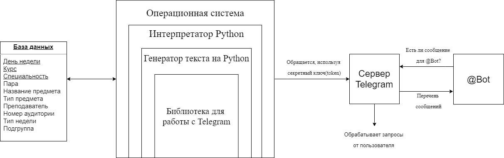

# Документация по установке и работе с telegram-ботом.

### 1. Установка и подключение к базе данных.
+ Для начала необходимо скачать и установить Python и Oracle database.
+ Создать соединение к базе данных.
+ В файле config.py изменить следующие параметры: 
> orcl_user = 'login'  - Логин пользователя базы данных

> orcl_password = 'password'  - Пароль пользователя базы данных

> https://www.google.com/orcl_dns = 'hostname/service_name'  - Указать свои данные

> token = 'Your token' - токен вашего telegram-бота.

Как получить token, если он отсуствует:

В Телеграме находим канал @BotFather — он отвечает за регистрацию новых ботов. Нажимаем Start и пишем команду /newbot. Нас по очереди спросят про название бота и его никнейм. После регистрации будет сгенерирован специальный ключ (например — 110201543: AAHdqTcvCH1vGWJxfSeofSAs0K5PALDsaw), с помощью которого, бот сможет получать от сервера Телеграмм все уведомления пользователей. Это позволяет пользователям отправлять сообщения даже в том случае, если бот временно не работает.

>open_weather_id = 'Your token'  - Токен с OpenWeather https://openweathermap.org/

>city = 000000  - Можно узнать с https://openweathermap.org/city/524901, где последнее - id города

+ Так же необходимо установить библиотеки для Python, если они отсутствуют, а именно:
> telebot(pyTelegramBotAPI)

> cx_Oracle

> schedule

> requests

Делается это через командную консоль(cmd) командой: pip install {Название библиотеки}

Если pip отсутствует, его необходимо установить(https://pip.pypa.io/en/latest/installing/).

+ Запустить файл install.py, который создаст таблицу и заполнит ее данными(делать нужно один раз при установке).(Так же для удаления можно использовать файл uninstall.py)
+ Запустить файл main.py
+ Вы восхитительны!

### 2. Команды бота.
Бот испоьзует 6 команд:

+ /time - Расписание звонков.
+ /weather - Погода в данный момент.
+ /groups - Список направлений подготовки.
+ /typeofweek - Показвает, какого типа неделя на данный момент.
+ /timetable - Команда для вывода расписания из базы данных. 
+ /sub - Отправка расписания и погоды по расписанию.

### 3. Принцип работы telegram-бота.
На компьютере работает интерпретатор Python, а внутри интерпретатора крутится наша программа на Python. Она отвечает за весь контент: в неё заложены все шаблоны текста, вся логика, всё поведение. Внутри программы на Python работает библиотека, которая отвечает за общение с сервером Телеграма. В библиотеку мы вшили секретный ключ, чтобы сервер Телеграма понимал, что наша программа связана с определённым telegram-ботом. Когда пользователь запрашивает у telegram-бота расписание, запрос приходит на сервер, а сервер отправляет его на наш компьютер. Запрос обрабатывается программой на Python, ответ идёт на сервер Телеграма, сервер отдаёт ответ пользователю. Telegram-бот работает в автономном режиме, т.е. когда запускается скрипт, он на регулярной основе опрашивает сервер Телеграмма на наличие новых сообщений для telegram-бота.

Обратите внимание, что работать telegram-бот будет только тогда, когда включён компьютер и на нём запущена программа на Python. Если компьютер выключится, пропадёт интернет или вы отключите интерпретатор, то telegram-бот работать перестанет: запросы будут приходить, но никто на них не ответит.

 
!!!Все данные записаны на момент I семетра 2020 года(возможны изменения со стороны университета). Они хранятся в файле config.py

Версии программ, используемые во время создания бота:

> Python 3.8 (https://www.python.org/)

> Oracle Database 19c (https://www.oracle.com/ru/database/technologies/)
